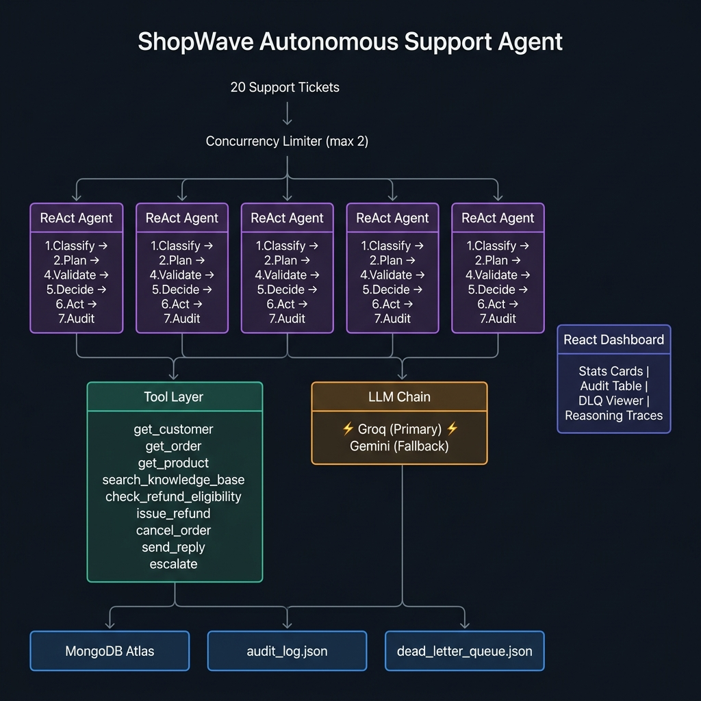

# ShopWave Autonomous Support Resolution Agent

**Hackathon 2026 — KSOLVES Agentic AI Challenge**

https://shopwave-two.vercel.app/

A production-grade autonomous support agent built on the MERN stack that resolves ShopWave customer support tickets using a ReAct (Reasoning + Acting) loop, concurrent processing, and a live React dashboard.

---

## Tech Stack

| Layer | Technology |
|---|---|
| Agent Orchestration | Custom ReAct loop (Node.js) |
| LLM — Primary | Groq API (Llama 3.3 70B) |
| LLM — Backup | Google Gemini 1.5 Flash |
| Backend | Node.js + Express |
| Database | MongoDB Atlas (optional — falls back to JSON) |
| Frontend | React + Vite + Tailwind CSS |
| Concurrency | Built-in async semaphore (CommonJS-compatible) |
| Logging | Winston (structured JSON) |

---

## Quick Start

### 1. Clone and install

```bash
# Backend
cd backend
npm install

# Frontend
cd ../frontend
npm install
```

### 2. Configure environment

```bash
cd backend
cp .env.example .env
# Open .env and add your API keys
```

Required environment variables:

```env
GROQ_API_KEY=your_groq_api_key_here       # Get free at console.groq.com
GEMINI_API_KEY=your_gemini_api_key_here   # Get free at aistudio.google.com
```

Optional:

```env
MONGODB_URI=mongodb+srv://...             # Free tier at mongodb.com/atlas
PORT=4000
MAX_CONCURRENCY=2  # Keep at 2 to stay within Groq free-tier rate limits
```

### 3. Run the agent (processes all 20 tickets)

```bash
cd backend
node main.js
```

### 4. Run single ticket

```bash
node main.js --ticket TKT-001
```

### 5. Start dashboard only

```bash
# Terminal 1 — backend API
cd backend && node main.js --server

# Terminal 2 — frontend
cd frontend && npm run dev
```

Dashboard available at: **http://localhost:5173**

---

## Architecture



```
Ticket Queue (20 tickets)
        |
        | Promise.all + p-limit semaphore (max 5 concurrent)
        |
┌───────▼────────────────────────────────────────┐
│           ReAct Agent Loop (per ticket)         │
│                                                 │
│  1. CLASSIFY  — LLM classifies category &       │
│                 urgency, extracts order_id       │
│                                                 │
│  2. PLAN      — Determines which tools to call  │
│                 (min 3 enforced)                │
│                                                 │
│  3. GATHER    — Calls read tools with retry     │
│     - get_customer(email)                       │
│     - get_order(order_id)                       │
│     - get_product(product_id)                   │
│     - search_knowledge_base(query)              │
│                                                 │
│  4. VALIDATE  — Detects malformed/partial data  │
│                 Social engineering detection    │
│                 Confidence scoring (0-1)        │
│                                                 │
│  5. DECIDE    — LLM makes final decision        │
│     resolve | escalate | decline | clarify      │
│                                                 │
│  6. ACT       — Calls write tools               │
│     - check_refund_eligibility (safety gate)    │
│     - issue_refund (irreversible — guarded)     │
│     - cancel_order                              │
│     - send_reply                                │
│     - escalate                                  │
│                                                 │
│  7. AUDIT     — Full trace → MongoDB + JSON     │
└─────────────────────────────────────────────────┘
        |
   ┌─────────────────────┐
   │  Dead Letter Queue  │  ← Failed tickets after 3 retries
   └─────────────────────┘
```

---

## Agent Capabilities

### Failure Resilience
- **6-Layer LLM Fallback** — strict Round-Robin across 4 Groq API keys, gracefully degrading to 2 Gemini backup keys across different models.
- **Exponential backoff** — 2^attempt × base_delay with ±20% jitter
- **3 retries** per tool call before failing gracefully
- **Dead-letter queue** — failed tickets persisted to `dead_letter_queue.json`, never dropped
- **Malformed data detection** — schema checks before acting on any tool output

### Agentic Behaviors
- **Minimum 3 tool calls** enforced per ticket
- **Confidence scoring** — auto-escalates if score < 0.6
- **Social engineering detection** — catches fake tier claims (TKT-018)
- **Safety guards** — `issue_refund` blocked without prior `check_refund_eligibility`
- **Idempotency** — prevents duplicate refunds within a session

### Concurrency
- All 20 tickets processed in parallel (not sequentially)
- Semaphore caps at 2 concurrent to respect Groq free-tier rate limits

---

## Output Files

| File | Description |
|---|---|
| `audit_log.json` | Full reasoning trace for all 20 tickets |
| `dead_letter_queue.json` | Failed tickets requiring manual review |
| `logs/agent.log` | Structured JSON log of all agent activity |
| `logs/error.log` | Isolated error log |

---

## Dashboard Features

- Live stat cards — resolved, escalated, avg confidence, fraud flags
- Decision distribution bar chart
- Audit log table with search and multi-filter
- Click any ticket row to inspect the full reasoning trace
- Tool call chain with expandable input/output payloads
- Dead letter queue viewer
- Auto-refreshes every 10 seconds

---

## API Endpoints

```
GET /api/health                 — Health check
GET /api/audit                  — All audit entries (supports ?status=&decision=)
GET /api/audit/:ticket_id       — Single ticket audit entry
GET /api/audit/stats/summary    — Dashboard statistics
GET /api/audit/dlq/list         — Dead letter queue entries
```

---

## Security

- No API keys in source code — all via `.env`
- `.env` is in `.gitignore`
- Helmet middleware for HTTP security headers
- CORS restricted to frontend origin only
- Refund operations require prior eligibility check (safety gate)

---

## Free API Keys

| Service | Free Tier | URL |
|---|---|---|
| Groq | 30 RPM, fast inference | console.groq.com |
| Gemini | 15 RPM, 1M context | aistudio.google.com |
| MongoDB Atlas | 512MB free cluster | mongodb.com/atlas |

---

## Running with Docker

```bash
docker-compose up --build
```

Agent: http://localhost:4000
Dashboard: http://localhost:5173
